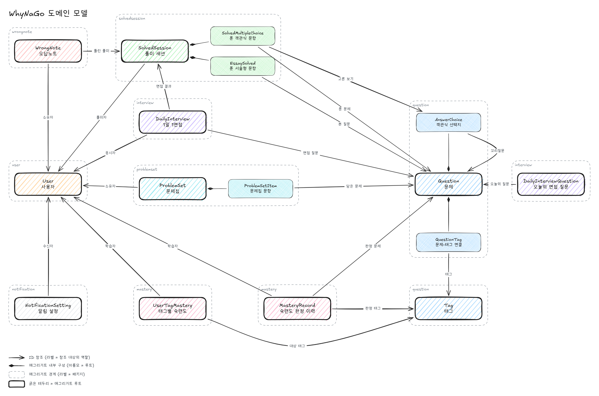

# 왜냐고 (WhyNaGo)

> 정답을 맞혔다고 끝나지 않는다. **"왜?"** 를 이어 묻는 개발자 지망생용 CS 문제 풀이 서비스

객관식·서술형 CS 문제를 풀면, 고른 답에 대해 **꼬리 질문**이 이어집니다. 면접에서 한 번 더 파고드는 질문처럼, 답의 근거까지 설명할 수 있는지를 확인합니다.

## 주요 기능

| 기능 | 설명 |
| --- | --- |
| **꼬리 질문 풀이** | 객관식은 고른 보기에 따라 다음 질문이 분기되고, 서술형은 답변 내용을 바탕으로 AI가 꼬리 질문을 생성합니다. |
| **서술형 AI 채점** | 루브릭 기반으로 서술형 답변을 채점하고 판정 근거를 함께 보여줍니다. |
| **숙련도 진단 · 맞춤 추천** | 풀이 결과를 태그 단위 숙련도로 기록하고, 약한 주제를 골라 맞춤 서술형 문항을 AI로 생성해 추천합니다. |
| **오답노트** | 틀린 문제를 자동으로 모아 다시 풀 수 있습니다. |
| **학습 기록 · 스트릭** | 공부 기록표, 연속 학습일, 진척도, 주간 리포트로 학습을 이어가도록 돕습니다. |
| **데일리 인터뷰** | 매일 면접형 질문을 받아볼 수 있습니다. |
| **관리자** | 문제 관리, AI 생성 문항 검수, 회원 관리, 이메일 발송을 지원합니다. |

다루는 카테고리: `DB` · `NETWORK` · `ALGORITHM` · `DATA_STRUCTURE` · `OS` · `DESIGN_PATTERN` · `LANGUAGE` · `GENERAL_CS` (태그 238개)

## 도메인 모델




- **Question(문제)** 은 서비스의 중심입니다. 객관식 선택지(`AnswerChoice`)와 태그 연결(`QuestionTag`)을 내부에 갖습니다. 선택지가 다음 문제를 가리키는 방식으로 꼬리질문이 이어지며, 그림의 `AnswerChoice → Question` 꼬리질문 화살표가 이 관계입니다.
- **SolvedSession(풀이 세션)** 은 본질문부터 꼬리질문까지 한 번에 이어 푼 단위입니다. 문항별 응답(`SolvedMultipleChoice`, `EssaySolved`)을 내부에 갖고, 어떤 문제를 풀었는지는 이 내부 엔티티가 참조합니다. 오답노트·1일 1면접은 결과를 따로 저장하지 않고 세션을 참조합니다.
- **MasteryRecord / UserTagMastery(숙련도)** 는 풀이 결과를 태그 단위로 판정한 이력과 현재 숙련도입니다. 맞춤 문제 추천이 이 값을 바탕으로 약점을 진단합니다.
- **DailyInterview(1일 1면접)** 는 진행 정보만 갖고, 그날 모두가 같은 질문을 받도록 `DailyInterviewQuestion`이 날짜별 질문을 고정합니다.
- **ProblemSet(문제집)** 은 사용자가 문제를 모아 둔 개인 목록으로, 담은 문제 하나하나가 내부 엔티티 `ProblemSetItem`입니다. **NotificationSetting(알림 설정)** 은 사용자별 학습 리마인드 수신 여부입니다.

자세한 속성과 정책은 [`docs/DOMAIN.md`](docs/DOMAIN.md)를 참고하세요.

## 기술 스택

**Backend**
- Java 21, Spring Boot 3.5, Spring Data JPA, Gradle
- Spring AI (운영: Gemini, 로컬: Ollama)
- MySQL 8, JWT, Google 소셜 로그인
- 테스트: JUnit 5, AssertJ, RestAssuredMockMvc, Testcontainers(MySQL)

**Frontend**
- Next.js 16 (App Router), React 19, TypeScript, Tailwind CSS v4

**Infra / 운영**
- Docker, Docker Compose, Nginx, AWS EC2
- Actuator, Prometheus, Grafana Alloy
- GA4, Microsoft Clarity

## 프로젝트 구조

```
.
├── src/main/java/com/neogul/whynago   # 백엔드 (도메인 중심 레이어드 아키텍처)
│   ├── auth, user, admin              # 인증 · 회원 · 관리자
│   ├── question, problemset           # 문제 · 문제 세트
│   ├── solvedsession, wrongnote       # 풀이 세션 · 오답노트
│   ├── mastery, recommendation        # 숙련도 · 맞춤 추천
│   ├── learningrecord, progress       # 학습 기록 · 진척도
│   ├── interview, notification        # 데일리 인터뷰 · 알림
│   └── common                         # 공통 (예외, 메일 등)
├── front/                             # 프론트엔드 (Next.js)
├── docs/                              # 아키텍처·컨벤션·도메인·API 문서
├── tools/question-pipeline/           # 문항·루브릭 생성 파이프라인
├── deploy/                            # 운영 배포 (Dockerfile, compose, nginx)
└── docker-compose.local.yml           # 로컬 통합 실행용 compose
```

각 도메인 패키지는 `presentation → service → implement → infra / domain` 레이어로 나뉘며, 의존성은 항상 아래 방향으로만 흐릅니다. 자세한 규칙은 [`docs/ARCHITECTURE.md`](docs/ARCHITECTURE.md)를 참고하세요.

## 실행 방법

### 1. Docker Compose로 전체 실행

```bash
docker compose -f docker-compose.local.yml up -d --build
```

- 프론트엔드: http://localhost:3000
- 백엔드: http://localhost:8080

종료는 `docker compose -f docker-compose.local.yml down` (`-v`를 붙이면 DB 볼륨까지 삭제)

### 2. 개별 실행

**백엔드** (저장소 루트)
```bash
./gradlew bootRun     # 8080 포트
./gradlew test        # 전체 테스트 (Docker 필요 - Testcontainers)
```

DB만 컨테이너로 띄우고 백엔드를 직접 실행하려면:
```bash
docker compose -f docker-compose.local.yml up -d db
SPRING_PROFILES_ACTIVE=local,local-mysql ./gradlew bootRun
```

**프론트엔드** (`front/`)
```bash
npm install
npm run dev           # http://localhost:3000
```

## 문서

| 문서 | 내용 |
| --- | --- |
| [ARCHITECTURE](docs/ARCHITECTURE.md) | 패키지 구조, 레이어 규칙, 트랜잭션 경계 |
| [CONVENTION](docs/CONVENTION.md) | 공통 코딩 컨벤션 |
| [EXCEPTION](docs/EXCEPTION.md) | 예외 처리 · 에러 응답 규격 |
| [API](docs/API.md) | HTTP API 요청/응답 규격 |
| [TEST](docs/TEST.md) | 테스트 컨벤션 |
| [DOMAIN](docs/DOMAIN.md) | 도메인 모델과 정책 |
| [RECOMMENDATION](docs/RECOMMENDATION.md) | 맞춤 문제 추천 전략 |
| [TAG](docs/TAG.md) | 문제 태그 사전 |
